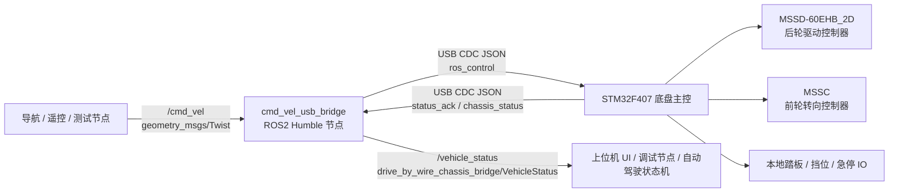
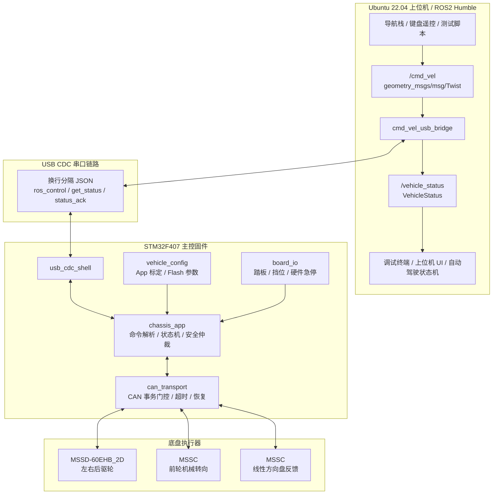
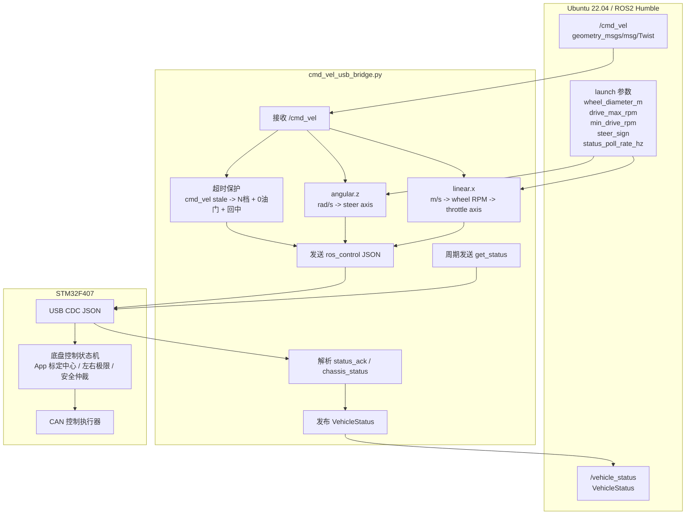
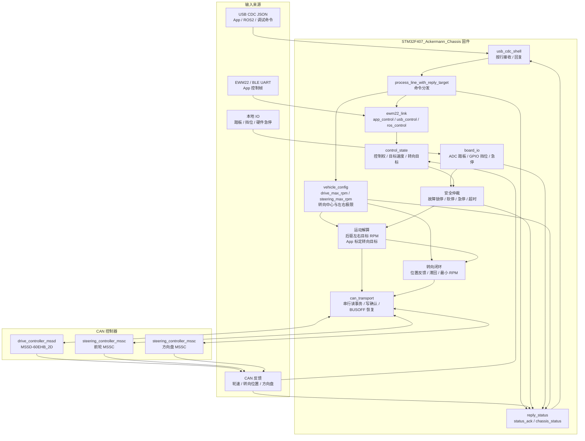
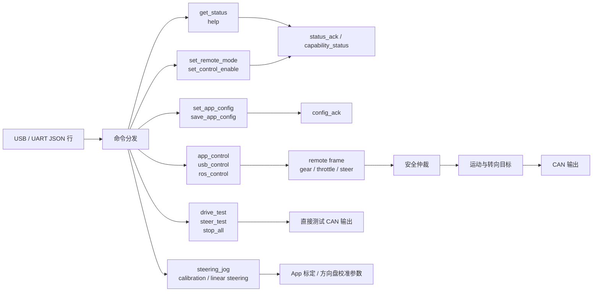
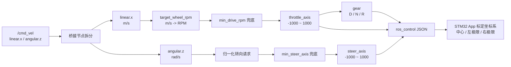
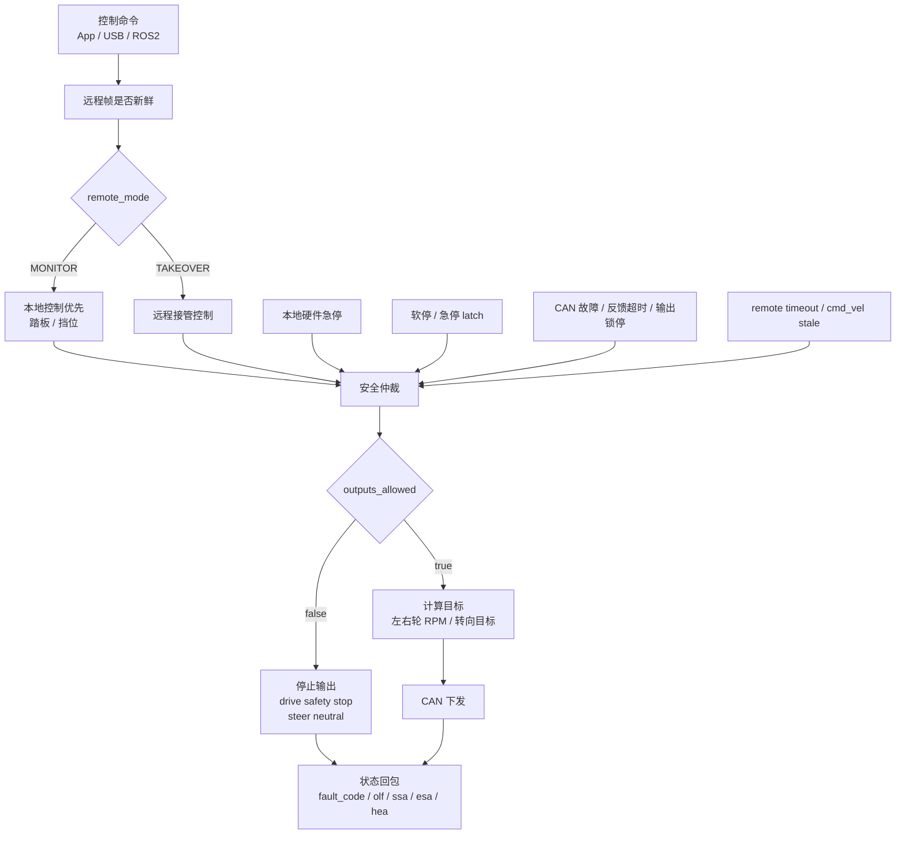
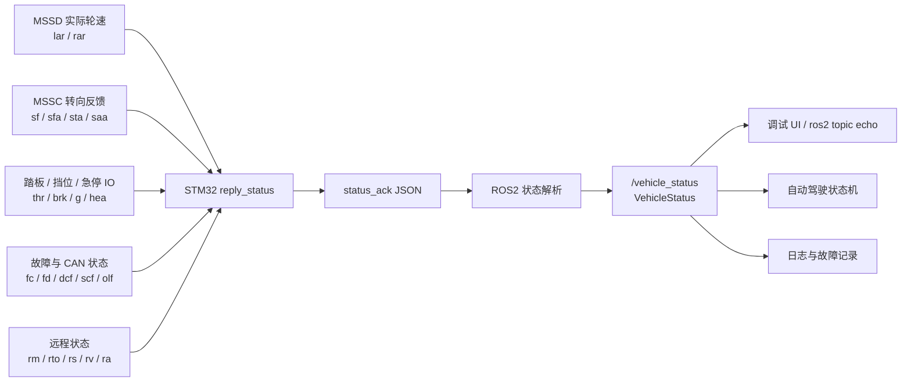
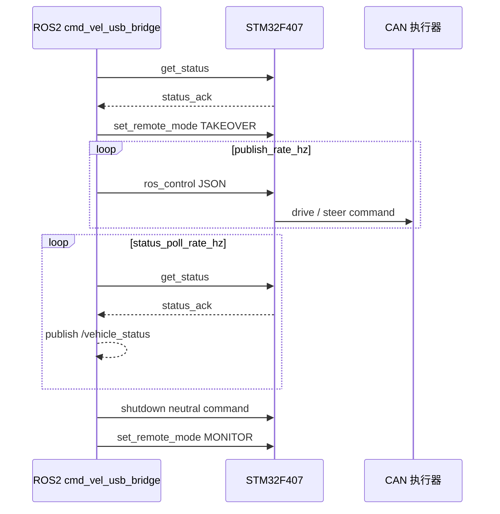

# ROS2 Humble 上位机架构

本文档描述 `v2.1.0` 新增的 ROS2 上位机层。当前 ROS2 环境为：

- Ubuntu 22.04
- ROS2 Humble
- STM32 连接方式：USB CDC
- 控制入口：`/cmd_vel`
- 底盘反馈：`/vehicle_status`

## 总体结构



ROS2 层只有一个核心节点：

```text
drive_by_wire_chassis_bridge/cmd_vel_usb_bridge
```

它负责两件事：

1. 把 ROS2 标准速度话题 `/cmd_vel` 转成 STM32 能理解的 USB JSON 控制帧。
2. 把 STM32 回读的 JSON 状态转成 ROS2 强类型底盘反馈话题 `/vehicle_status`。

## 全链路分层图



## ROS2 节点内部结构



## STM32 固件内部结构



STM32 固件的关键边界：

- `usb_cdc_shell` 只负责 USB CDC 收发和按行组包。
- `chassis_app` 负责 JSON 命令分发、控制权、安全状态、运动目标和状态回包。
- `vehicle_config` 保存 App 标定和运行参数，例如 `drive_max_rpm`、`steering_max_rpm`、转向中心点、左极限和右极限。
- `can_transport` 负责 CAN 事务门控、回复匹配、超时统计和恢复。
- `drive_controller_mssd` 面向后轮驱动控制器 `MSSD-60EHB_2D`。
- `steering_controller_mssc` 面向前轮转向控制器和线性方向盘控制器 `MSSC`。

## STM32 命令分发图



ROS2 桥接层正常使用的是：

- `get_status`
- `set_remote_mode`
- `ros_control`

调试或现场排障时才会使用：

- `drive_test`
- `steer_test`
- `stop_all`
- `set_app_config`

## 控制话题 `/cmd_vel`

订阅话题：

```text
/cmd_vel
geometry_msgs/msg/Twist
```

当前使用字段：

- `linear.x`：车辆前后速度，单位 `m/s`
- `angular.z`：车辆转向角速度，单位 `rad/s`

当前不使用字段：

- `linear.y`
- `linear.z`
- `angular.x`
- `angular.y`

桥接节点会把 `/cmd_vel` 转成 STM32 JSON：

```json
{"cmd":"ros_control","seq":1,"gear":"D","throttle":300,"steer":-120,"aux_x":0,"aux_y":0,"buttons":0}
```

档位由 `throttle` 自动决定：

- `throttle > 0`：`gear = D`
- `throttle < 0`：`gear = R`
- `throttle == 0`：`gear = N`

## 速度换算

ROS2 输入是标准速度，单位为 `m/s`。STM32 驱动轮控制使用 RPM 量级，所以桥接节点做如下换算：

```text
target_wheel_rpm = linear.x / (pi * wheel_diameter_m) * 60
throttle_axis = target_wheel_rpm / drive_max_rpm * 1000
```

当前实车轮径默认：

```text
wheel_diameter_m = 0.25
```

因此：

```text
100 RPM ≈ 1.31 m/s
150 RPM ≈ 1.96 m/s
200 RPM ≈ 2.62 m/s
```

相关参数在 launch 中修改：

```bash
ros2 launch drive_by_wire_chassis_bridge cmd_vel_usb_bridge.launch.py \
  wheel_diameter_m:=0.25 \
  drive_max_rpm:=150.0 \
  min_drive_rpm:=100.0
```

## 控制换算细节图



## 转向换算

`angular.z` 会被转成 STM32 的 `steer` 轴值：

```text
steer axis range = -1000 ~ 1000
```

STM32 端仍然使用 App 标定的转向中心点、左极限和右极限：

- `steer = 0`：回到 App 标定中心点
- `steer = -1000`：转向到 App 标定左侧范围
- `steer = 1000`：转向到 App 标定右侧范围

如果现场方向相反，使用：

```bash
ros2 launch drive_by_wire_chassis_bridge cmd_vel_usb_bridge.launch.py \
  steer_sign:=-1.0
```

## 控制权和安全仲裁图



这个图里需要特别注意：

- ROS2 节点退出时会发送中位控制帧，并把 STM32 切回 `MONITOR`。
- `/cmd_vel` 超时后，ROS2 节点会继续发送安全中位帧。
- STM32 端仍然保留本地硬件急停、软停、急停、CAN 故障锁停和远程帧新鲜度判断。

## 底盘反馈话题 `/vehicle_status`

发布话题：

```text
/vehicle_status
drive_by_wire_chassis_bridge/msg/VehicleStatus
```

查看命令：

```bash
ros2 topic echo /vehicle_status
ros2 interface show drive_by_wire_chassis_bridge/msg/VehicleStatus
```

主要反馈字段：

- `gear`：STM32 当前反馈档位
- `control_owner`：当前控制来源
- `remote_mode`：`MONITOR` 或 `TAKEOVER`
- `remote_takeover`：远程是否接管
- `control_enabled`：底盘输出是否允许
- `outputs_locked_by_fault`：是否因故障锁停
- `soft_stop_active`：软停状态
- `emergency_stop_active`：急停状态
- `hardware_estop_active`：硬件急停状态
- `fault_code` / `fault_domain`：故障码和故障域
- `left_target_rpm` / `right_target_rpm`：左右驱动轮目标 RPM
- `left_wheel_rpm` / `right_wheel_rpm`：左右驱动轮实际反馈 RPM
- `linear_speed_mps`：由实际 RPM 反算出的线速度
- `steering_target_raw`：转向目标原始值
- `steering_feedback_raw`：转向反馈原始值
- `remote_source`：远程来源，例如 `USB_JSON`
- `ble_connected`：BLE 是否连接
- `last_cmd_gear`：ROS2 节点最近一次下发的档位
- `last_cmd_throttle_axis`：ROS2 节点最近一次下发的油门轴值
- `last_cmd_steer_axis`：ROS2 节点最近一次下发的转向轴值
- `cmd_vel_stale`：是否因为 `/cmd_vel` 超时进入安全中位命令
- `raw_json`：STM32 原始 JSON 状态包

反馈速度换算：

```text
linear_speed_mps = average(left_wheel_rpm, right_wheel_rpm) * pi * wheel_diameter_m / 60
```

## 底盘反馈链路图



STM32 状态字段到 ROS2 字段的核心映射：

| STM32 JSON 字段 | ROS2 `VehicleStatus` 字段 | 含义 |
| --- | --- | --- |
| `g` | `gear` | STM32 当前反馈档位 |
| `rm` | `remote_mode` | `MONITOR` / `TAKEOVER` |
| `rto` | `remote_takeover` | 远程是否接管 |
| `fc` / `fd` | `fault_code` / `fault_domain` | 故障码和故障域 |
| `lr` / `rr` | `left_target_rpm` / `right_target_rpm` | 左右轮目标 RPM |
| `lar` / `rar` | `left_wheel_rpm` / `right_wheel_rpm` | 左右轮实际反馈 RPM |
| `str` / `sf` | `steering_target_raw` / `steering_feedback_raw` | 转向目标和反馈原始值 |
| `sta` / `saa` | `steering_target_angle_deg` / `steering_actual_angle_deg` | 转向目标角和实际角 |
| `rs` | `remote_source` | 远程来源，例如 `USB_JSON` |
| `ble_connected` | `ble_connected` | BLE 连接状态 |

## 控制权和安全行为



节点启动后默认进入 `TAKEOVER`，让 ROS2 上位机接管控制。节点退出时会发送中位安全命令，并让 STM32 回到 `MONITOR`。

如果只想查看底盘反馈、不想让 ROS2 接管：

```bash
ros2 launch drive_by_wire_chassis_bridge cmd_vel_usb_bridge.launch.py \
  enable_remote_takeover:=false
```

## 文件位置

ROS2 桥接包：

```text
ros2_ws/src/drive_by_wire_chassis_bridge
```

节点源码：

```text
ros2_ws/src/drive_by_wire_chassis_bridge/drive_by_wire_chassis_bridge/cmd_vel_usb_bridge.py
```

消息定义：

```text
ros2_ws/src/drive_by_wire_chassis_bridge/msg/VehicleStatus.msg
```

启动文件：

```text
ros2_ws/src/drive_by_wire_chassis_bridge/launch/cmd_vel_usb_bridge.launch.py
```
